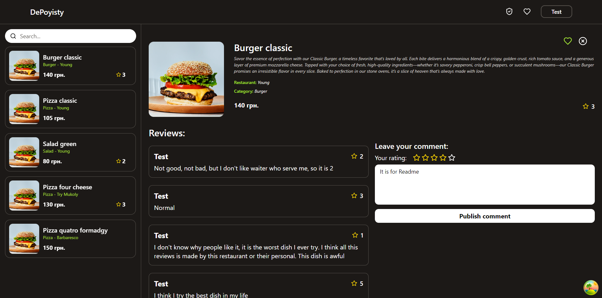
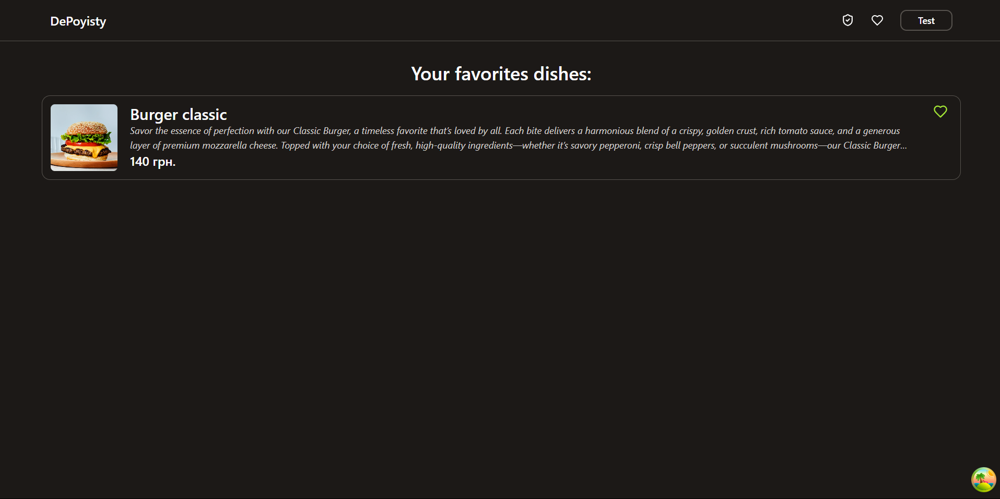
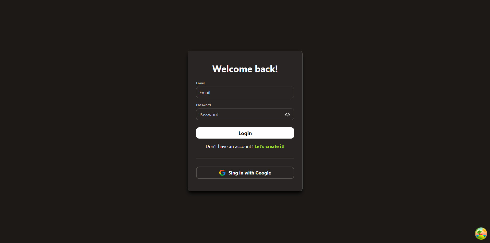
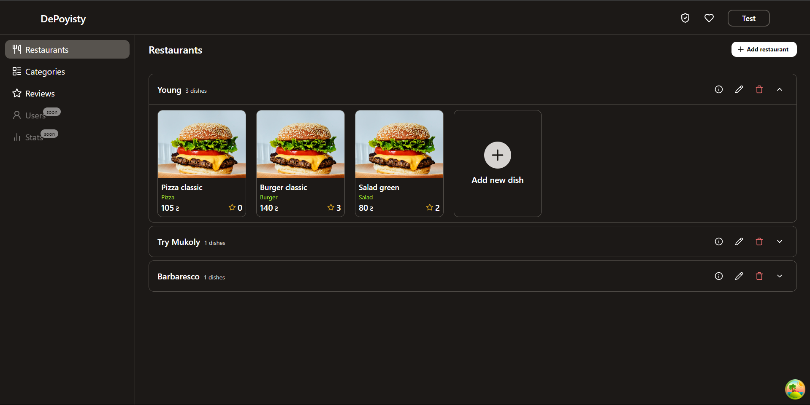
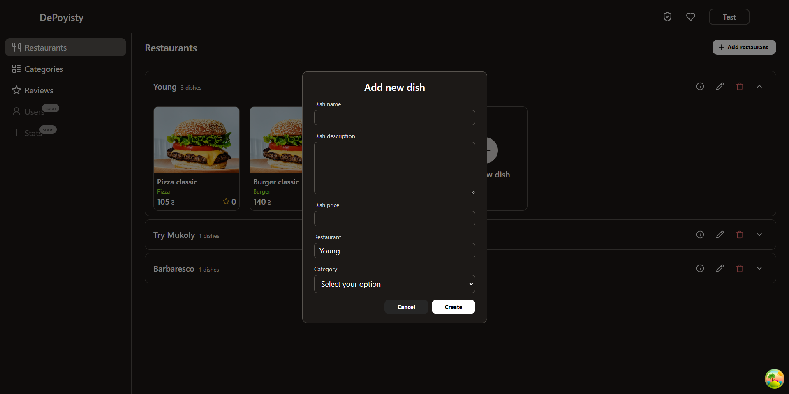
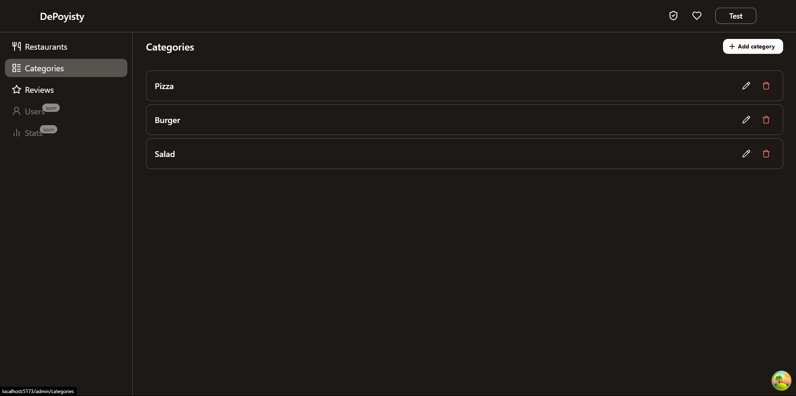
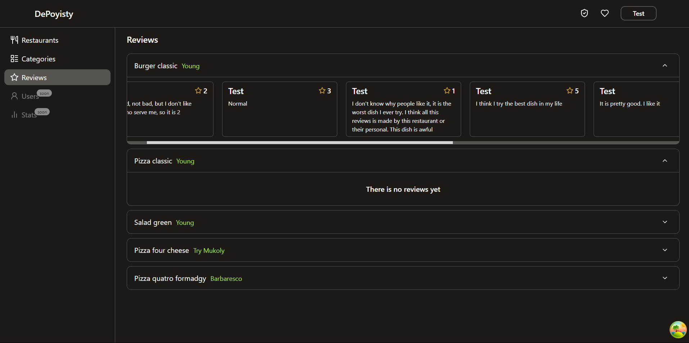

<h1 align="center" style="font-weight: bold;">DePoyisty Frontend 🍽️</h1>

<p align="center">
    <b>It is the first version (MVP) for web app of DePoyisty where you can find some food, see it details, save to favorite and leave reviews. Later users can have opportunity to see the restaurant of dish they select in map.</b>
</p>

<h2 id="technologies">🌐 Release</h2>
<p>I have a free backend production, so you will need to wait some time. Here is a <a href="https://depoyisty.netlify.app">link</a>.</p>

<h2 id="technologies">💻 Technologies</h2>


<h2 id="started">🖼️ Some images</h2>

<h3>Main page</h3>


<h3>Favorite page</h3>


<h3>Auth page</h3>


<h3>Admin restaurant page</h3>


<h3>Admin add new dish dialog</h3>


<h3>Admin category page</h3>


<h3>Admin reviews page</h3>



<h2 id="started">🚀 Getting started</h2>

Clone repo to your desktop, don't forget to install all dependencies and open project in some code editor or IDE

<h3>Prerequisites</h3>

Here are list of all prerequisites necessary for running this project:


<h3>Cloning</h3>

How to clone this project

```bash
git clone https://github.com/DenysJSE/DePoyistyFrontendWeb.git
```
<p>Also you will need to clone backend for this project to start it.</p>
Here is the <a href="https://github.com/DenysJSE/DePoyistyBackend">link</a>

<h3>Config .env variables</h2>

You will need to crete `.env` file with variables below to start this project

```yaml
VITE_API_URL='http://localhost:404/api'
VITE_COOKIE_DOMAIN='localhost'
```

<h3>Starting</h3>

How to start your project

```bash
npm run dev
```